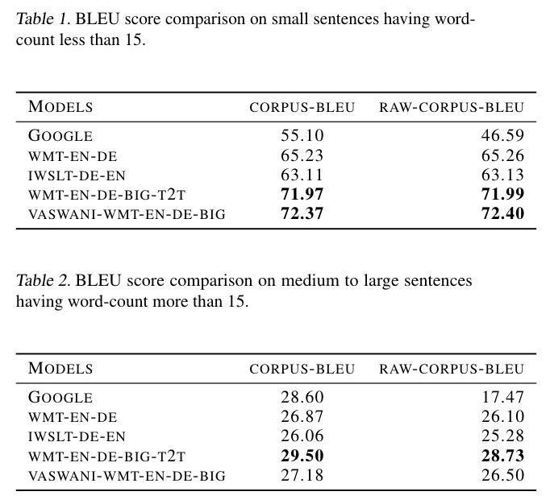
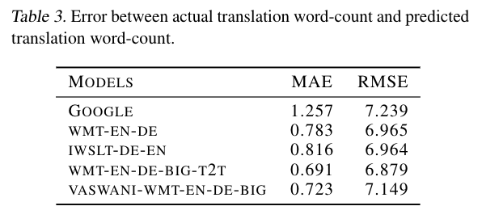

# Marathi To English Neural Machine Translation With Near Perfect Corpus And Transformers

### Abstract

There have been very few attempts to benchmark performances of state-of-the-art algorithms for Neural Machine Translation task on Indian Languages. Google, Bing, Facebook and Yandex are some of the very few companies which have built translation systems for few of the Indian Languages. Among them, translation results from Google are supposed to be better, based on general inspection. Bing-Translator do not even support Marathi language which has around 95 million speakers and ranks 15th in the world in terms of combined primary and secondary speakers. In this exercise, we trained and compared variety of Neural Machine Marathi to English Translators trained with BERT-tokenizer by huggingface and various Transformer based architectures using Facebook's Fairseq platform with limited but almost correct parallel corpus to achieve better BLEU scores than Google on Tatoeba and Wikimedia open datasets.

### BLEU Score Comparison

### Word-Count Error Comparison

### Files

* Reference File, Tatoeba + Wikimedia parallel corpus => set3_mr_en.tsv (TAB separated)
* Common translation text for all model (Not Null/Empty Translation) => valid_mr.text (TAB separated)
* Model Outputs => \*.mr.en files for each model
* Sample Tokenized Datasets => test.mr and test.en
* Translation Output images in a folder
* Tatoeba + Wikimedia Dataset used for score calculations & comparisons => set3_mr_en.tsv
